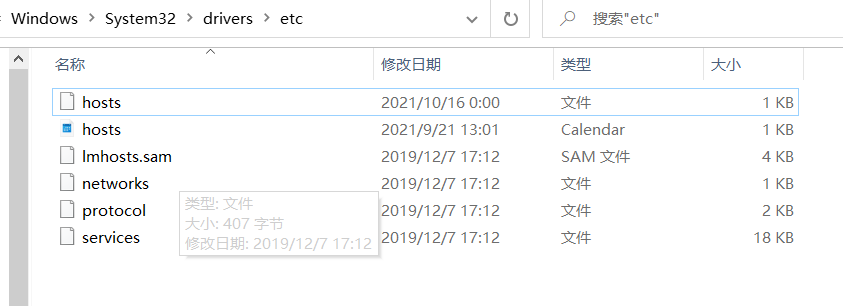
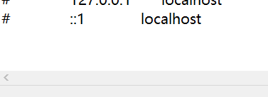
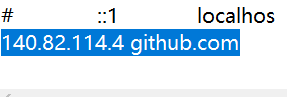
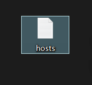
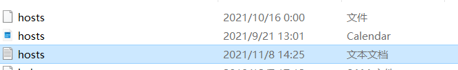
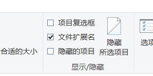
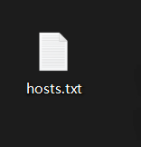
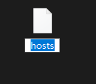
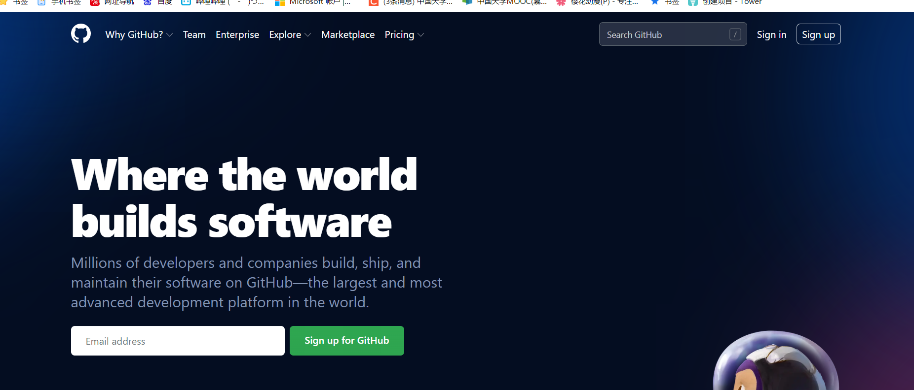

# github.com进不去的解决办法

参考[csdn]([https://blog.csdn.net/weixin_44012722/article/details/107739638?ops_request_misc=%257B%2522request%255Fid%2522%253A%2522163633517616780261988479%2522%252C%2522scm%2522%253A%252220140713.130102334..%2522%257D&request_id=163633517616780261988479&biz_id=0&utm_medium=distribute.pc_search_result.none-task-blog-2~all~top_click~default-4-107739638.first_rank_v2_pc_rank_v29&utm_term=github&spm=1018.2226.3001.4187](https://blog.csdn.net/weixin_44012722/article/details/107739638?ops_request_misc=%7B%22request%5Fid%22%3A%22163633517616780261988479%22%2C%22scm%22%3A%2220140713.130102334..%22%7D&request_id=163633517616780261988479&biz_id=0&utm_medium=distribute.pc_search_result.none-task-blog-2~all~top_click~default-4-107739638.first_rank_v2_pc_rank_v29&utm_term=github&spm=1018.2226.3001.4187))

1.用记事本打开C:\Windows\System32\drivers\etc\hosts

2. 在最下方添加如图内容（具体怎么得到的参考上方博客）

   

3. 然后保存桌面，发现它成为了一个文本文档，需要去掉它的后缀名

   

4. 然后把它拖放到目录里替换原文件，

   

5. 就能正常进入github了

   
