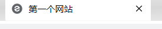
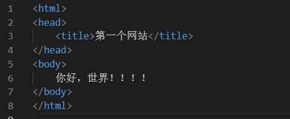
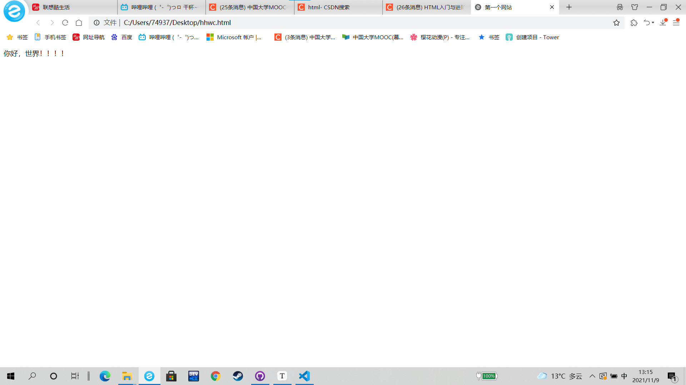

# 基础HTML标签

## 1.html

<hrtml>标签以<html>开始，以</html>结束

~~~html
<html>
    其他标签放中间
</html>
~~~

## 2.head

~~~html
<html>
    <head>
        <title>第一个网站</title><!--<title>里边是网站的标题 -->
    </head>
</html>
~~~

标题就像这样

.

## 3.body

~~~html
定义网站主体
<html>
    <head>
        <title>第一个网站</title><!--<title>里边是网站的标题 -->
    </head>
    <body>
        你好，世界！！！！！<!--网站的内容写在这里-->
    </body>
</html>
~~~

## 4.段落，文字

- 段落标签

| 标签      | 语义            | 说明             |
| :-------- | :-------------- | :--------------- |
| <h1>~<h6> | header          | 标题             |
| 
       | paragraph       | 段落             |
|        | break           | 换行             |
| 
      | horizontal rule | 水平线           |
| 
     | division        | 分割（块元素）   |
|     | span            | 区域（行内元素） |

- 文本格式化标签

| 标签     | 语义                  | 说明 |
| :------- | :-------------------- | :--- |
| <strong> | strong（加强）        | 加粗 |
| <em>     | emphasized（强调）    | 斜体 |
| <cite>   | cite（引用）          | 斜体 |
|     | superscripted（上标） | 上标 |
|     | subscripted（下标）   | 下标 |

## 4. 块元素和行内元素

(1)、HTML元素根据浏览器表现形式分为两类：①块元素；②行内元素；

(2)、块元素特点：

1. 独占一行，排斥其他元素跟其位于同一行，包括块元素和行内元素；
2. 块元素内部可以容纳其他块元素或行元素；
   - 常见块元素有：h1~h6、p、hr、div等。
3. 行内元素特点：
   1. 可以与其他行内元素位于同一行；
   2. 行内内部可以容纳其他行内元素，但不可以容纳块元素，不然会出现无法预知的效果；
      - 常见行内元素有：strong、em、span等
        